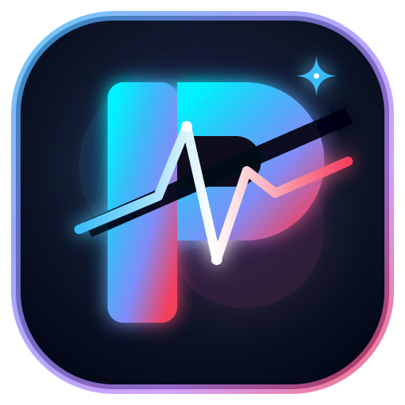

# PulseCut Local AI — Private Long Video to Shorts Studio

<div align="center">
  
  <h3>Turn Long Videos Into Scroll-Stopping Shorts — 100% in Your Browser</h3>
  <p>
    <a href="https://pulsecut-ai.vercel.app" target="_blank"><strong>🌐 Live Demo</strong></a> •
    <a href="https://pulsecut-ai.vercel.app/studio" target="_blank"><strong>🎬 Open Studio</strong></a> •
    <a href="https://pulsecut-ai.vercel.app/about" target="_blank"><strong>📖 Architecture</strong></a>
  </p>
  <p>
    
    
    
    
  </p>
</div>

---

## 🚀 What Is PulseCut Local AI?

**PulseCut Local AI** is a production-quality, fully browser-based studio for converting long horizontal, vertical, or square videos into multiple professionally edited social-media Shorts — with **zero cloud uploads**, **zero API keys**, and **zero privacy risk**.

> Your videos are processed entirely inside your browser using modern WebCodecs API and Web Audio API. Nothing ever leaves your device.

---

## ✨ Key Features

| Feature | Description |
|---|---|
| 🎬 **Smart Clip Splitter** | Mathematically exact split into 9:16 Shorts (15s–180s per clip) |
| 🖼️ **AI Smart Reframe** | 8 strategies: Center, Face Focus, Fit+Blur, Speaker Focus, Gameplay, Manual |
| 📝 **Kinetic Subtitle Engine** | 12 animated subtitle themes (Karaoke, TikTok Bold, Neon, etc.) |
| 🔊 **Full Audio Export** | WebCodecs + Web Audio AAC pipeline — sound included in every MP4 |
| ✏️ **Custom Filenames** | Rename each Short before downloading |
| 📱 **Platform Presets** | YouTube Shorts, TikTok, Instagram Reels, X, Threads (safe zones included) |
| 🎯 **Hook Generator** | Local AI-generated viral opener text for each clip |
| 💾 **File System Streaming** | Stream renders directly to disk for large files (no RAM limits) |
| 🔒 **100% Private** | Zero server uploads. WebCodecs + OffscreenCanvas + Web Audio — all on device |
| ⚡ **60 FPS Render** | Hardware-accelerated H.264 via GPU WebCodecs encoder |

---

## 🛠️ Tech Stack

- **Framework**: Next.js 15 (App Router) + TypeScript
- **Styling**: Tailwind CSS v3 + custom design system
- **Video Engine**: WebCodecs API (`VideoEncoder`, `AudioEncoder`, `VideoFrame`)
- **Audio**: Web Audio API (`AudioContext`, `decodeAudioData`) → AAC via `AudioEncoder`
- **Muxing**: `mp4-muxer` v5 (H.264 + AAC in MP4 container, in-browser)
- **AI Hooks**: Client-side NLP keyword extraction + hook generation
- **Favicon**: Custom SVG + PNG multi-resolution icon suite (16, 32, 180, 192, 512px)
- **Monorepo**: npm workspaces (`apps/web`, `packages/*`)

---

## 🗂️ Project Structure

```
youtube-long-to-shots/
├── apps/
│   └── web/                  # Next.js 15 frontend (the main app)
│       ├── src/
│       │   ├── app/          # App Router pages
│       │   ├── components/   # Navbar, Footer, ProcessingScreen
│       │   ├── lib/          # videoEngine, localAI, subtitles, deviceDetector
│       │   └── config/       # APP_CONFIG (brand, URLs, navigation)
│       └── public/           # Favicons, manifest.webmanifest
├── packages/
│   ├── shared/               # calculateClips, formatDuration utilities
│   ├── platform-presets/     # Platform safe zones + aspect ratios
│   └── video-config/         # Bitrate & codec configuration
└── scripts/                  # generate_favicons.js
```

---

## ⚡ Local Development

```bash
# 1. Clone the repo
git clone https://github.com/Code-With-Bitwizards-20/pulsecut-local-ai.git
cd pulsecut-local-ai

# 2. Install dependencies
npm install

# 3. Start dev server
cd apps/web && npm run dev

# Or from root:
npm run dev

# App is running at http://localhost:3000
```

> No `.env` file required for local development — the app is 100% client-side.

---

## 🌐 Deploy on Vercel

[](https://vercel.com/new/clone?repository-url=https://github.com/Code-With-Bitwizards-20/pulsecut-local-ai)

**Manual Vercel Deployment Settings:**
- **Root Directory**: `apps/web`
- **Framework Preset**: `Next.js`
- **Build Command**: `npm run build`
- **Output Directory**: `.next` *(auto-detected)*
- **Install Command**: `cd ../.. && npm install`

**Environment Variables on Vercel:**
```
NEXT_PUBLIC_APP_URL = https://pulsecut-ai.vercel.app
NODE_ENV = production
```

---

## 🤝 Built By

Designed & Developed with ❤️ by **[Code With Bitwizards](https://code-with-bitwizards.vercel.app/)**

[](https://code-with-bitwizards.vercel.app/)
[](https://github.com/Code-With-Bitwizards-20)
[](https://www.linkedin.com/in/codewithbitwizards1000)
[](https://www.fiverr.com/s/BRjgpyb)
[](https://www.upwork.com/freelancers/~01b261308dace9725e?mp_source=share)

---

## 📄 License

MIT License © 2026 Code With Bitwizards
